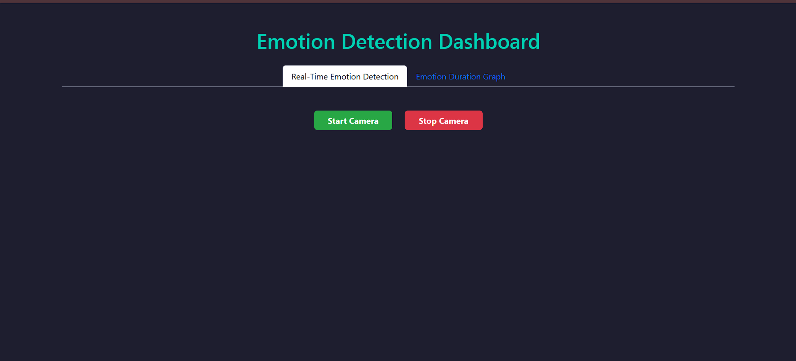
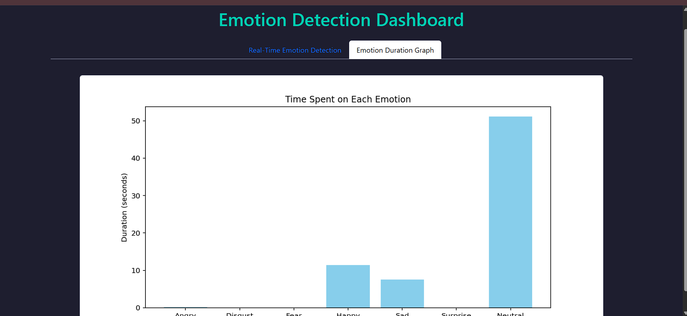

# 🎭 Emotion Detection Dashboard (Flask + TensorFlow)

A real-time facial emotion recognition web app using **Flask**, **OpenCV**, and **TensorFlow**. It detects emotions through your webcam, tracks how long you display each emotion, and visualizes the results with a live graph — all from a clean and modern web dashboard.

---

## 🎯 Aim

The goal of this project is to:
- Detect facial emotions in **real-time**
- Track the **duration** of each detected emotion
- Display an **interactive UI** that shows both video feed and emotion graph
- Provide a useful tool for understanding mood trends over time

---

## ⚙️ How It Works

1. The webcam feed is processed using **OpenCV** to detect faces.
2. Each face is passed to a pre-trained **Keras model** that classifies it into one of 7 emotions.
3. A timer keeps track of how long each emotion is shown.
4. When you stop the camera, a **bar chart** is generated showing total time spent on each emotion.
5. Everything is displayed in a stylish **Bootstrap-powered web dashboard**.

---

## 📸 Preview

| 🎥 Real-Time Emotion Detection | 📊 Emotion Duration Graph |
|-------------------------------|----------------------------|
| Click the Start button to see your webcam feed with live emotion labels.<br><br> | Visual breakdown of how long each emotion was detected.<br><br> |

---

## 🚀 Features

- 🔍 **Real-time Emotion Detection** from webcam
- 🧠 **Deep Learning Model** (`emotion_model.h5`) powered by TensorFlow/Keras
- 📈 **Live Emotion Duration Graph**
- 🎨 Clean Bootstrap 5 UI
- 🧪 Start/Stop camera from the interface

---

## 📁 Folder Structure

```
emotion-dashboard/
│
├── model/
│   └── emotion_model.h5
├── templates/
│   └── emotion.html
├── images/
│   ├── dashboard_home.png
│   ├── emotion_graph.png
├── app.py
├── requirements.txt
└── README.md
```

---

## 🧠 Model Download

Due to file size restrictions, the trained emotion detection model (`emotion_model.h5`) is not included here.

📎 [Download emotion_model.h5 from Google Drive](https://drive.google.com/file/d/1NTBksHB1ljIfriCH24Hw-5C4a8PzZynB/view?usp=drive_link)

Place the downloaded file inside the `model/` directory as shown above.

---

## 🛠 Requirements

Create a `requirements.txt` file:

```
flask==2.2.5
opencv-python==4.9.0.80
numpy==1.23.5
tensorflow==2.12.0
matplotlib==3.7.1
Pillow==9.5.0
```

Install dependencies:

```bash
pip install -r requirements.txt
```

---

## ▶️ Run the App

```bash
python app.py
```

Then open your browser and go to:  
📍 `http://127.0.0.1:5000`

---

## 📌 Notes

- Ensure your webcam is connected and allowed.
- Place the trained model `emotion_model.h5` inside the `model/` folder.
- Tested on Python 3.8+

---

## 🙏 Thanks

Thanks for checking out this project!  
If you found it helpful or inspiring, feel free to ⭐️ the repo or suggest improvements.

